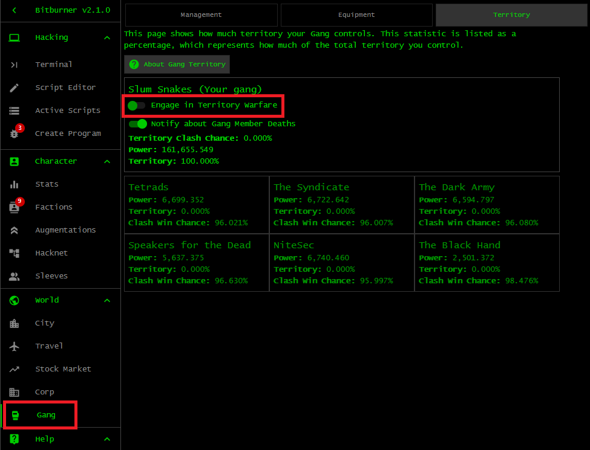

# BitNode-2: Rise of the Underworld

The theme of this BitNode is crime. Committing a crime is significantly more
profitable, in fact 300% more profitable, as compared to BN1. The BitNode
introduces a mechanic that allows you to create a gang. The primary source of
income for your gang is committing various crimes. The most profitable crimes
scale off the percentage of territory your gang controls. More territory
translates to higher profit potential. Gaining more territory requires you to
wage turf war against rival gangs. Properly managed, your gang can be one of
your best sources of passive income. Note that the namespace of the
[Gang API](https://github.com/bitburner-official/bitburner-src/blob/dev/markdown/bitburner.gang.md)
is `ns.gang.functionName()`, instead of `ns.Gang.functionName()`. Completing
BN2.3 would reward you with 42% increase of multipliers that affect your crime
success rate, the amount of money you gain from crimes, and Charisma.

Start a gang as early in a BitNode as possible. Join one of the criminal (or
hacking) factions and create a gang within that faction. Your occupation would
then be managing the faction's gang. You would no longer have the option to
undertake field work (or any other work) for the faction. Following a soft
reset, your progress with the gang persists. The gang remains a part of the
faction within which it was created and the progress of your gangsters do not
reset. Furthermore, you remain a member of the particular faction and the amount
of favour you have accumulated with the faction do not reset. However, the
amount of reputation you have with the faction resets. Creating a gang within
one faction would prevent you from creating another gang within a different
organization. You would be stuck with the gang, and be a member of the faction,
for the rest of your playthrough in the particular BitNode. The only way to
reset your gang is to use `b1t_flum3.exe` to enter the same BitNode again or
travel to a different BitNode.

## Requirements

The requirements for creating a gang can vary, depending on the BitNode you are
in. In BN2, you only need to satisfy the requirements for a faction to send an
invitation. Being a member of the faction automatically allows you to form a
gang within that faction. However, in other BitNodes you must also have karma at
-54,000 or lower. Satisfying the requirements to join a faction is not enough.
In a BitNode other than BN2, the main obstacle to creating a gang is lowering
your karma as quickly as possible. Having sleeves, which are unlocked in BN10,
would help to rapidly lower your karma. How do you know your current karma
level? Use a hidden function called `ns.heart.break()` like so:

```js
/**
 * Our current karma level.
 *
 * @param ns The Netscript API.
 */
export async function main(ns) {
    ns.tprint(ns.heart.break());
}
```

In BitNodes other than BN2, grind karma to -54,000 or lower as soon as possible.
Your script to grind karma might start with shoplift. Commit this crime a few
times to build your Dexterity and Agility stats. Then move on to mugging to
build all your combat stats at once, i.e. Strength, Defense, Dexterity, and
Agility. Raise all your combat stats to around 30 each. Finally, commit homicide
because it yields more negative karma than shoplift and mugging combined, and
takes roughly the same amount of time to complete as those two crimes. Let your
grinding script continue to commit homicide until your karma is at -54,000 or
lower. Homicide is the best crime for quickly lowering your karma and earning
money. Data available [here](../../data/crime/). In case you have sleeves,
assign them to commit crimes in the above order as well.

## Criminal or hacking?

You have a choice among two types of gangs:

1. _Criminal gang._ This type of gang primarily focuses on blue-collar crimes
   such as mugging, dealing drugs, strongarm civilians, running a con, armed
   robbery, trafficking illegal arms, threaten and blackmail, human trafficking,
   and terrorism. Most of these crimes scale off the combat stats of a gangster.
   Some of these crimes are primarily Charisma-based and benefit from high
   Charisma. The following factions allow you to create a criminal gang: Slum
   Snakes, Tetrads, The Syndicate, The Dark Army, and Speakers for the Dead.
1. _Hacking gang._ This type of gang primarily focuses on white-collar crimes
   such as creating and distributing ransomware, phishing, identity theft, DDoS
   attacks, creating and distributing computer viruses, fraud and
   counterfeiting, money laundering, and cyberterrorism. NiteSec and The Black
   Hand are the only two factions that allow you to create a hacking gang.

Which faction should you join to create your gang? Slum Snakes is generally the
best faction for creating a gang. Among all factions in which you can create a
gang, Slum Snakes requires the least amount of time because it has the lowest
requirements for sending a faction invitation. When you create a gang for the
first time in BN2, Slum Snakes is an ideal faction to help you learn about
managing a gang. Feel free to experiment by creating a gang within a different
faction.

It is not possible to create a mixed criminal/hacking gang. The reason is that
having a gang within one faction would prevent you from creating another gang in
a different faction. However, you can let your gangsters role-play to some
extent. Create a criminal gang. As you recruit more members to your gang, you
can choose to take a gangster along one of three paths.

1. _Combat path._ This path consists of tasks that are centred around the combat
   stats. A gangster only needs to train their combat stats. The following
   crimes scale off the combat stats: mug people, strongarm civilians, run a
   con, armed robbery, human trafficking, traffick illegal arms. A gangster
   taking the combat path should be assigned the above tasks in the order listed
   to help the member build their stats and work toward trafficking illegal
   arms, which yield the most money of any task in all three paths.
1. _Charisma path._ This path is centred around tasks that scale with the
   Charisma stat. A gangster that takes the Charisma path should also have done
   some training in combat stats. The following crimes scale off the Charisma
   stat: deal drugs, mug people, strongarm civilians, run a con, armed robbery,
   threaten and blackmail, human trafficking, traffick illegal arms. Assign a
   gangster to each task in the given order and gradually work toward
   trafficking illegal arms because the latter task yields the highest amount of
   money. For role-playing purposes you might want to assign your gangster to
   human trafficking.
1. _Hacking path._ This path revolves around tasks that scale with the Hack
   stat. A gangster taking this path should have some training in combat stats
   and Charisma. The following tasks in a criminal gang scale off the Hack stat:
   strongarm civilians, armed robbery, threaten and blackmail, human
   trafficking, traffick illegal arms. In a criminal gang, assign your gangster
   to the above tasks in the given order. This helps to build their stats so
   they would be able to take on trafficking illegal arms. For role-playing
   purposes you might want to let your gangster aim for and remain in human
   trafficking.

To let your gangsters role-play, assign some members to train combat, some other
members to train Charisma and combat stats, and the remaining members to train
Hack and Charisma. Let them train their stats for a while. Move a member out of
training once each of their relevant stats is at least a given threshold, e.g.
each of Strength, Defense, Dexterity, and Agility is at least 15. The above
role-playing strategy would certainly increase the complexity of your gang
script(s). You might find it easier to let all members of a criminal gang take
the combat path because tasks that scale off combat stats generally yield more
money than other tasks.

## Increase respect

You initially start with 3 gang members. Respect is mandatory for recruiting
more members to your gang. The amount of respect required to recruit the next
member increases the more gangsters you have. Your gang can have at most 12
members, meaning that you can stop worrying about respect once you have 12
gangsters. The best tasks for increasing respect are terrorism (if you are in a
criminal gang) and cyberterrorism (if you are in a hacking gang). Other tasks
increase respect as well, but not by as many as the latter 2 tasks.

The amount of respect your gang has can affect the price of equipment. Higher
respect translates to higher discount in the equipment shop.

## Lower penalty

The penalty $p$ is defined as the ratio of your wanted level over your respect:

```math
penalty
=
\frac{
   wanted\_level
}{
   total\_respect
}.
```

Multiply $p$ by 100 to see that the penalty expresses the wanted level as a
percentage of your respect.

📝 Effects of penalty on your gang.

You should not be worrying about your penalty until you have a full house, i.e.
12 gang members. Early in your gang's existence, you should focus on raising
respect to recruit more members to your gang and building the stats of your
members, especially the Defense stat. Assign each recruit to train their combat
stats, after which graduate them to strongarming civilians. Leave the gangster
at the latter task for a while until their combat stats are high enough to be
assigned to armed robbery. Let the gangster train their stats in the latter task
for a while, then assign them to traffick illegal arms. Finally, graduate the
gangster to commit acts of terrorism. The above course of tasks would train a
gangster's combat stats until they are ready for terrorism, where they will farm
respect to help you recruit more members. Do not worry about penalty or that
your gang is not generating money. You should have other sources of income such
as a batcher, a trade bot, a Coding Contract solver, etc.

Having recruited 12 gang members, assign all of them to traffick illegal arms.
You can now worry about and monitor your penalty. The best tasks for lowering
your penalty are vigilante justice (in a criminal gang) and ethical hacking (in
a hacking gang). Define a penalty window $[t, T]$ and constantly monitor your
penalty. If your penalty is at least $T$, assign one or more members to
vigilante justice (or ethical hacking). When your penalty has decreased below
$t$, reassign members from vigilante justice (or ethical hacking) to tasks that
earn money. However, if your respect increases faster than your wanted level,
you might want to ignore your penalty altogether and instead assign your members
to tasks that generate income.

## Ascension

Ascension is a way to permanently boost a gangster's stat multipliers. However,
the costs include:

1. Reset the gangster's progress and stats. This is usually not a downside
   because the boosted stat multipliers can help the ascended member to quickly
   level up again.
1. The gangster loses all non-Augmentation equipment. This might or might not be
   a problem, depending on your current funds and the percentage discount you
   get in the equipment shop. Higher respect means you get a higher discount in
   the equipment shop.
1. The gangster loses all respect points they have accumulated. The respect
   points gained by this gangster would be deducted from your total respect. The
   lost respect points would most certainly result in a decrease of the discount
   you get in the equipment shop. Furthermore, the lost respect points can
   increase your penalty. Refer to the penalty formula above. Your wanted level
   might stay the same after an ascension. However, since you lost a chunk of
   respect points following the ascension, the penalty increases.

After an ascension, a gangster would start with higher stat multipliers than
previously and would usually be able to quickly retrain their stats. You need to
strike a balance between whether to ascend a gangster for the boost to stat
multipliers, or remain as is to keep the gangster's current stats. You do not
want to ascend a gangster too often, but at the same time you also want to
empower the gangster as much as possible. In your first foray into gang
management, you might want to set the ascension threshold at 1.25. If an
ascension would result in 25% boost to one or more of a gangster's stats, then
you ascend the gangster in question.

## Augmentation

Augmentations provide another means to permanently boost the stat multipliers of
your gang members. Another benefit of Augmentations is that a gangster retains
the Augmentation boosts even if the gangster ascends. Augmentations can be
expensive early in your gang's existence, but the prices decrease as your gang
becomes more powerful and your respect grows. Prioritize the purchase of
Augmentations over other equipment. In general, try to first purchase an
Augmentation that raises Defense. Higher defense translates to a lower
probability of death during a clash against a rival gang.

## Equipment

Equipment are accessories that can be purchased and equipped on a gangster.
These are weapons, armour, vehicles, and rootkits. These are also known as
non-Augmentation equipment to distinguish them from Augmentation equipment. Your
gangster loses all equipment after an ascension. You should prioritize the
purchasing of equipment that increases a gangster's Defense. A higher Defense
stat means a lower probability of death while your gang clashes against a rival
gang. All armour pieces raise Defense, but not all weapons raise Defense. Once a
gangster has most or all items (Augmentations and equipment) that raise their
Defense, focus on acquiring the remaining items to boost various stats.

## Gang power

Your gang's power affects your chance of winning a clash against a rival gang.
The higher is your gang's power, the higher is your chance of winning a clash.
The best task for increasing your gang's power is territory warfare. This
member-based task is not the same as the slider in the user interface that
allows your whole gang to engage in territory warfare. An unfortunate source of
confusion, I know. Refer to the image below. You can have the slider be off
while assigning one or more gang members to the task of territory warfare. Doing
so would increase your gang's power, but does not affect the percentage of
territory that your gang controls. To increase your share of territory, have the
territory warfare slider be switched on.



Your gang's power also affects the price you pay in the equipment shop. Like
respect, higher power translates to a higher discount in the shop. The best
combination is high respect and high power to significantly raise the discount
you get in the shop.

## Territory warfare

Territory warfare, both the member-based task and the gang-wide state, is the
only means of increasing your power and enlarging your turf. The tasks that earn
the most money are those that scale with your territory. Trafficking illegal
arms and human trafficking are two such tasks. The more territory your gang
controls, the more money you would earn from the above tasks. To allow your
whole gang to engage in territory warfare, in the user interface locate the
slider that says <kbd>Engage in Territory Warfare</kbd> and set it to on.
Alternatively, use the function
[`ns.gang.setTerritoryWarfare()`](https://github.com/bitburner-official/bitburner-src/blob/dev/markdown/bitburner.gang.setterritorywarfare.md).

Early in your gang's existence, concentrate on these objectives:

1. Recruit the maximum number of gang members, i.e. 12, as quickly as possible.
1. Build your members' stats, especially the Defense stat. A gangster's Defense
   stat helps to keep them alive during a clash against a rival gang.
1. Equip your members with as many Augmentations as possible, preferably all
   Augmentations. Prioritize Augmentations that raise a member's Defense.
1. Equip your members with as many accessories as possible. Prioritize equipment
   that raise a member's Defense.
1. Assign one or more members to territory warfare as a means of raising your
   gang's power. You can raise your gang's power even when your whole gang is
   not engaged in territory warfare, i.e. the territory warfare slider is
   switched off.

When should your whole gang be engaged in territory warfare? The following
guidelines might help:

1. Each of your 12 gangsters should have as high Defense as possible, preferably
   at least 600 Defense. Higher Defense translates to a lower probability of
   death during a clash against a rival gang. In case a gangster happens to die
   during a clash, their respect would be deducted from your total respect and
   you must then increase your respect to recruit a replacement. Install on each
   gangster all Augmentations that raise Defense and equip all accessories that
   raise Defense as well. Assign a gangster to tasks that train their combat
   stats.
1. Build your gang power high enough so that its minimum clash win chance $p$ is
   at least 55%. Do so while the territory warfare slider is switched off. The
   value of $p$ should be the minimum of all clash win chances against each of
   the rival gangs. The reason is that when you switch on the territory warfare
   slider, every 20 seconds there is a chance to randomly clash against a rival
   gang. You cannot determine ahead of time which gang you would fight against.
1. When you enable territory warfare for your whole gang, approximately every 20
   seconds your gang has a chance to clash against a rival gang. Just before
   your gang is about to clash against a rival gang, assign all your gangsters
   to territory warfare. After the clash, reassign your gangsters to their usual
   tasks.

[[TOC](README.md "Table of Contents")]
[[Previous](intelligence.md "BitNode-5: Artificial Intelligence")]
[[Next](wolf.md "BitNode-8: Ghost of Wall Street")]

[](http://creativecommons.org/licenses/by-nc-sa/4.0/)
