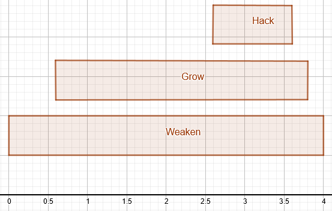

# Hack, grow, weaken (HGW)

A hack/grow/weaken (or HGW) algorithm uses a separate script for each of the
functions
[`ns.hack()`](https://github.com/bitburner-official/bitburner-src/blob/dev/markdown/bitburner.ns.hack.md),
[`ns.grow()`](https://github.com/bitburner-official/bitburner-src/blob/dev/markdown/bitburner.ns.grow.md),
and
[`ns.weaken()`](https://github.com/bitburner-official/bitburner-src/blob/dev/markdown/bitburner.ns.weaken.md).
You create the following worker scripts:

<!-- prettier-ignore -->
- [`hack.js`](script/hgw/hack.js) -- Should only have the function
  [`ns.hack()`](https://github.com/bitburner-official/bitburner-src/blob/dev/markdown/bitburner.ns.hack.md).
- [`grow.js`](script/hgw/grow.js) -- Should only have the function
  [`ns.grow()`](https://github.com/bitburner-official/bitburner-src/blob/dev/markdown/bitburner.ns.grow.md).
- [`weaken.js`](script/hgw/weaken.js) -- Should only have the function
  [`ns.weaken()`](https://github.com/bitburner-official/bitburner-src/blob/dev/markdown/bitburner.ns.weaken.md).

Each worker script should only have one of the dedicated HGW functions so as to
maximize RAM usage. How you use the worker scripts is a different matter.

<!-- ====================================================================== -->

## Prepping

At heart, an HGW algorithm relies on a target server being _prepped_. To prep a
server means to lower the server's security to its minimum and grow the server's
money to maximum. You typically start by running
[`ns.weaken()`](https://github.com/bitburner-official/bitburner-src/blob/stable/markdown/bitburner.ns.weaken.md)
against the target, followed by
[`ns.grow()`](https://github.com/bitburner-official/bitburner-src/blob/stable/markdown/bitburner.ns.grow.md).
As long as the target is not yet prepped, you repeat the weaken and grow
operations. A server is in the prepped state when its security is at minimum and
its money is at maximum. You then run your HGW algorithm against the prepped
server.

Apart from being used in an HGW algorithm, a prepped server can also be used to
farm Hack XP. The idea is to continually spam
[`ns.grow()`](https://github.com/bitburner-official/bitburner-src/blob/stable/markdown/bitburner.ns.grow.md)
against a prepped server. A grow operation against a prepped server would not
increase money on the server because it already has maximum money. For this
reason, the server's security level does not change but remains at minimum.
Furthermore, you reap Hack XP from the grow operation. Spamming grow operations
against a prepped server would always leave the server in the prepped state
while increasing your Hack XP.

> **Problem 1.** Write a script that uses world servers you have nuked to prep a
> target server.
>
> **Problem 2.** Use a purchased server to prep a target server.
>
> **Problem 3.** The server `joesguns` is the best target for farming Hack XP.
> Write a farming script that uses nuked world servers to farm Hack XP from a
> prepped `joesguns`.

<!-- ====================================================================== -->

## Sequential batcher

The first task you might want to do is write a sequential batcher that pools the
resources of world servers in order to target a common server. A sequential
batcher is easy to implement and is the next step up from using the basic
hacking script to target a world server. Replace the general-purpose hack script
from the chapter [_First script_](script.md) with a script that uses the HGW
worker scripts.

<!-- ====================================================================== -->

### Benefits

Advantages of a sequential batcher include:

<!-- prettier-ignore -->
- Easy to understand. You prep a target, wait for the prepping operation to
  complete, then hack the target. At the end of the hack operation, you repeat
  the prep/hack loop. You always wait for an operation to complete before
  launching the next operation.
- Easy to implement. A sequential batcher can be implemented with a botnet or
  a purchased server. However, you might find that it is easier and simpler to
  use a purchased server in your implementation. Dedicate all RAM in your
  botnet or purchased server to each of the grow and weaken operations, then
  hack a percentage of money from the prepped server. Wait for one operation
  to complete, then launch another HGW operation.
- No special tools required. You do not need any port opener programs to
  assemble a small botnet for your sequential batcher. In the absence of any
  port openers, nuke as many world servers as you can and use their collective
  RAM for HGW operations against a chosen target, usually `joesguns`. Every
  now and then, purchase a port opener via the dark web (you require access to
  the TOR router) and nuke any world servers you can to expand the collective
  RAM of your botnet. In case your `home` server has a decent amount of RAM,
  your sequential batcher can use your `home` RAM as well. On the other hand,
  buy a server with a decent amount of RAM and use the purchased server to run
  your sequential batcher. Running a sequential batcher on a purchased server
  has the advantage that you do not need to worry about buying port openers.
  The only time when you need to buy port openers is to nuke a target server.
  The server `joesguns` can be nuked without having to open any of its special
  ports. You only need to ensure you have the minimum Hack stat in order to
  hack `joesguns`.

<!-- ====================================================================== -->

### Disadvantages

Cons of a sequential batcher include:

<!-- prettier-ignore -->
- Must wait for an HGW operation to finish before you can launch another HGW
  operation. The bottleneck is waiting for the prep operation to complete so
  you can launch the hack operation.
- The waiting time between the launching of consecutive HGW operations means
  that your sequential batcher might not be generating money as quickly as you
  want. You would not be able to generate money until the target server is
  prepped and the hack operation completes.

<!-- ====================================================================== -->

### Algorithm outline

Your sequential batcher accomplishes the following tasks. The algorithm
described below assumes you use the collective RAM of a botnet. However, the
algorithm can easily be adapted to a purchased server.

1. _Nuke._ Gain root access to as many world servers as possible. The
   compromised servers are your botnet. Adapt one or more of the algorithms
   described in the section [_Your first worm_](reboot.md#your-first-worm) to
   help you scan all servers in the network of world servers.
1. _scp._ Copy the HGW worker scripts to each server in your botnet.
1. _Target._ Determine which common server your botnet should target. One way to
   help you determine the target is to use the server rater described in the
   section [_Your first worm_](reboot.md#your-first-worm). This approach might
   not be a good idea depending on which server your botnet is targeting. Each
   world server generally has limited RAM. The collective RAM of all world
   servers is too small to be used to target a server that has a high Hack
   requirement and/or high security. You might want to follow a rule of thumb
   called _Joe's n00dles phantasy_:
    - Target `n00dles` if you have less than 2 port opener programs. For
      example, the easiest port opener programs to create (and cheapest to buy)
      are `BruteSSH.exe` and `FTPCrack.exe`. In the absence of one or both of
      these programs, direct your botnet to target `n00dles`.
    - Target `joesguns` if you have at least 2 port opener programs, but you do
      not have all of the remaining 3 port opener programs.
    - Target `phantasy` if you have all 5 port opener programs and the server's
      Hack requirement is less than half of your Hack stat.
1. _Prep._ To prep a server means to weaken it to its minimum security level and
   grow the server to the maximum amount of money it can hold. The prepping
   procedure runs the [`grow.js`](script/hgw/grow.js) and
   [`weaken.js`](script/hgw/weaken.js) worker scripts in a loop until such a
   time as the target server is at its minimum security level and holds the
   maximum amount of money possible, i.e. the target is prepped. The loop either
   runs:

    - [`grow.js`](script/hgw/grow.js) followed by
      [`weaken.js`](script/hgw/weaken.js); or
    - [`weaken.js`](script/hgw/weaken.js) followed by
      [`grow.js`](script/hgw/grow.js).

    The order in which the loop runs [`grow.js`](script/hgw/grow.js) and
    [`weaken.js`](script/hgw/weaken.js) might affect the time required for the
    target server to be prepped. For example,
    [experimental data](../../data/hgw/README.md) show that the prepping loop
    for `n00dles` and `joesguns` should be [`grow.js`](script/hgw/grow.js)
    followed by [`weaken.js`](script/hgw/weaken.js), whereas the prepping loop
    for `phantasy` should be [`weaken.js`](script/hgw/weaken.js) followed by
    [`grow.js`](script/hgw/grow.js). Direct all servers in your botnet to prep a
    target server. Each server in the botnet should use all of its available RAM
    to run a worker script. When in doubt, weaken a target first, then grow the
    target.

1. _Hack._ Steal money from the prepped server. Unlike the prepping stage,
   during the hacking stage you should refrain from using all servers in your
   botnet to run the [`hack.js`](script/hgw/hack.js) worker script against the
   target server. The reason is simple. The more money you hack from a server,
   the longer it would take to prep the server again. You want to hack a
   fraction of the (prepped) target's money such that the subsequent prepping
   time is as low as possible, but at the same time you want to steal as much
   money as possible within a given time frame. Which fraction of money should
   you hack in order to satisfy the above two objectives?
   [Experimental data](../../data/hgw/README.md) show that you should steal 70%
   of money from a prepped `n00dles`, steal 60% of money from a prepped
   `joesguns`, and aim to steal 100% of money from a prepped `phantasy`. On the
   other hand, you might want to steal 50% of money from any prepped server.
   Suppose you want to hack 50% of a prepped server's money. Choose from among
   your botnet a combination of servers having enough RAM to run
   [`hack.js`](script/hgw/hack.js) and allow you to steal 50% of the target's
   money.
1. _Loop._ Repeat steps 4 and 5. Cycle back to the _prep_ and _hack_ operations.
   Repeat as often as necessary or, better yet, loop through the _prep_ and
   _hack_ operations infinitely many times. As you are relying on the RAM of
   world servers, every now and then perform the _nuke_ and _scp_ operations to
   enlarge your botnet and hence increase the pooled RAM. On the other hand,
   after step 5 you might want to repeat everything from step 1 onward but this
   time you skip step 3 because you have already decided on a target server.

The sequential batcher described above is illustrated in the image below. You
essentially launch one operation, wait for it to finish, then launch another
operation. This is why we used the word "sequential". Each operation is
performed in sequence, one after the other. Here is an
[example sequential batcher](script/hgw/world.js) that pools the resources of
world servers to hack a common target.

<!-- ====================================================================== -->

### Experimental results

Is the sequential batcher any better than the basic script `hack.js`? Let's
define some terms. By _naive technique_ we mean a manager script that uses the
basic script `hack.js` and pools the resources of world servers to hack a common
target. The term _wbatcher technique_ refers to the sequential batcher as
described in this section, where we pool the resources of world servers and use
the HGW worker scripts to target a common server.
[Experimental data](../../data/hgw/world.md) show that when hacking `n00dles`,
the wbatcher technique requires nearly an hour and a half to steal $100m,
whereas the naive technique takes about 42 minutes. The situation is reversed
when we target `joesguns`. The wbatcher technique requires about 1 hour and 2
minutes to hack $1b from `joesguns`, whereas the naive technique takes over 1
hour and 26 minutes. As regards the server `phantasy`, the naive technique
requires about 2 hours less than the wbatcher technique to steal $10b from
`phantasy`. The experiment shows that the naive technique outperforms the
wbatcher technique whenever we are hacking `n00dles` or `phantasy`. However, if
we want to hack `joesguns` then we should use the wbatcher technique.

The sequential batcher algorithm outlined above can be adapted to run on a
purchased server. Instead of pooling the resources of a botnet of world servers,
you purchase a server with as high RAM as you can afford and run a sequential
batcher on that purchased server. As shown in this
[set of experimental data](../../data/hgw/pserv.md), the effectiveness of the
sequential batcher depends on the amount of RAM of the purchased server. The
higher is the RAM of a purchased server, the less time it takes for the
sequential batcher to steal a given amount of money from a target. In another
[set of experiments](../../data/hgw/world.md), we used a purchased server having
524,288GB RAM to steal money from `n00dles`, `joesguns`, and `phantasy`. Let's
call this the _pbatcher technique_. When targeting `n00dles`, the pbatcher
technique requires 53 minutes to steal $100m, outperforming the wbatcher
technique. However, this is still worse than the naive technique, which requires
nearly 42 minutes. When targeting `joesguns`, we start to see the effectiveness
of the pbatcher technique. While the naive technique requires about 1 hour and
26 minutes to steal $1b from `joesguns`, the pbatcher technique requires 29
minutes to steal the same amount of money, outperforming the wbatcher technique
as well. Moving on to `phantasy`, we see that the pbatcher technique requires
nearly 2 hours to steal $10b from `phantasy`, finishing about 1 hour earlier
than the naive technique and approximately 3 hours earlier than the wbatcher
technique. Given enough RAM, the pbatcher technique can outperform the naive and
wbatcher techniques.

> **Problem 1.** The sequential batcher described in this section can be adapted
> to the case of purchased servers. Write a sequential batcher that uses the RAM
> of world servers to hack `joesguns`. Raise enough money to purchase a server
> with a large amount of RAM and use the purchased server to run the sequential
> batcher. As a start, you might want to raise enough money to buy a server
> having at least 500GB RAM. Let the batcher run for a while until you have
> generated sufficient funds to upgrade the server to a higher amount of RAM.
>
> **Problem 2.** When your Hack stat is high enough (e.g. at least 200 Hack) and
> you have sufficient money, purchase another server having at least 500GB RAM
> and run a sequential batcher on that server against `phantasy`. Every once in
> a while, upgrade the RAM of the server.
>
> **Problem 3.** Write a sequential batch manager whose job is to purchase a
> server and deploy a sequential batcher on the server against a target. Use the
> weight formula described in the section
> [_Your first worm_](reboot.md#your-first-worm) to help you choose a target for
> your batcher. Every now and then, upgrade the RAM of any server in your farm
> or add another server to your farm.

<!-- ====================================================================== -->

## Proto batcher

A proto batcher is similar to a sequential batcher, but without waiting for one
HGW operation to complete before launching another HGW operation. Recall that in
the model of a sequential batcher, you must wait for the prep operation to
complete, then you can launch the hack operation. Furthermore, in the prep
operation you must wait for the weaken operation to finish before you are able
to launch the grow operation. The sequential batcher essentially requires you to
wait for any HGW operation to finish prior to launching the next HGW operation.
The proto batcher model tries to parallelize each of the hack, grow, and weaken
operations as much as possible.

### Benefits

Advantages of a proto batcher include:

<!-- prettier-ignore -->
- Less waiting. The gist of a proto batcher is to parallelize the hack, grow,
  and weaken operations. Doing so cuts down on the waiting time that is
  inherent in the model of the sequential batcher.
- More money. Less time spent on waiting means we are able to launch various
  HGW operations sooner. The sooner we are able to launch HGW operations, the
  sooner our hack operation can run to steal money from a target.

### Disadvantages

Cons of a proto batcher include:

<!-- prettier-ignore -->
- Special tool required. A proto batcher relies on the
  [Formulas API](https://github.com/bitburner-official/bitburner-src/blob/stable/markdown/bitburner.formulas.md),
  accessible after purchasing the program `Formulas.exe` via the dark web. You
  can also create the program provided you have the required Hack stat and
  willing to wait for the program to finish. See the chapter
  [_BitNode-5: Artificial Intelligence_](intelligence.md) for a way to have
  permanent access to `Formulas.exe`. The most useful function you want from
  the Formulas API is
  [`ns.formulas.hacking.growThreads()`](https://github.com/bitburner-official/bitburner-src/blob/stable/markdown/bitburner.hackingformulas.growthreads.md),
  which allows you to calculate the number of threads required to grow a
  hacked server back to its maximum money.
- Memory hog. Depending on how you implement a proto batcher, it might require
  a dedicated purchased server with plenty of RAM. After a hack operation
  completes, you want the grow operation to replenish a target server back to
  its maximum money. Furthermore, you want the weaken operation to lower the
  target's security level to its minimum. Each of the grow and weaken
  operations requires plenty of RAM in order to bring the target to the
  prepped state, ready for the next hack operation.

### Algorithm outline

The algorithm described below assumes you are using a purchased server having
plenty of RAM. A batch consists of a hack, grow, and weaken operation running in
parallel. The gist of a proto batcher (and a parallel batcher) is to schedule
the hack, grow, and weaken operations in such a way that they run in parallel.
The first operation to finish should be hack, followed by grow, and finally the
weaken operation. After the hack operation steals the pre-determined percentage
of money from the target, the grow operation should fully replenishes money on
the target. The weaken operation counteracts the security increase of the hack
and grow operations. After the completion of a batch, the target should be in
the prepped state.

1. _pserv._ Purchase a server having plenty of RAM. Copy the HGW worker scripts
   over to the purchased server.
1. _Nuke._ Decide on a target you want to hack and nuke the target.
1. _Prep._ Grow the target to maximum money. Weaken the target to its lowest
   security level.
1. _Hack._ Decide on the percentage of money to steal from a prepped target. The
   more money you hack from a prepped target, the more grow threads you require
   to fully replenish the target, and the more weaken threads you need to lower
   the target's security level to its minimum. Calculate the number of hack
   threads you need as well as the time in milliseconds required for `ns.hack()`
   to complete.
1. _Grow._ Calculate how many grow threads you need to grow the target server to
   its maximum money. The number of grow threads required is based on the
   percentage of money you have decided to hack from the target. Use the
   function
   [`ns.formulas.hacking.growThreads()`](https://github.com/bitburner-official/bitburner-src/blob/stable/markdown/bitburner.hackingformulas.growthreads.md)
   from the Formulas API. Work out the amount of time in milliseconds required
   for `ns.grow()` to complete.
1. _Weaken._ Determine how many levels would the hack and grow operations add to
   the security of the target. One thread of `ns.hack()` usually increases
   security by 0.002. One thread of `ns.grow()` usually increases security by
   0.004. One thread of `ns.weaken()` decreases security by 0.05. However, the
   above security increases (and decrease) do not always hold true and can
   change depending on how far you are in the game. It is safer to use the
   functions
   [`ns.hackAnalyzeSecurity()`](https://github.com/bitburner-official/bitburner-src/blob/stable/markdown/bitburner.ns.hackanalyzesecurity.md),
   [`ns.growthAnalyzeSecurity()`](https://github.com/bitburner-official/bitburner-src/blob/stable/markdown/bitburner.ns.growthanalyzesecurity.md),
   and
   [`ns.weakenAnalyze()`](https://github.com/bitburner-official/bitburner-src/blob/stable/markdown/bitburner.ns.weakenanalyze.md).
   Use the above information to calculate the number of threads required to run
   `ns.weaken()`. Let $s$ be the total security increase brought about by hack
   and grow. Let $w_s$ be the amount of security that is lowered by one thread
   of `ns.weaken()`. Then you require at most $\lceil s / w_s \rceil$
   `ns.weaken()` threads in order to lower the target's security back to its
   minimum.
1. _Schedule._ Each of the hack, grow, and weaken operations in a batch must be
   scheduled such that one operation finishes a brief moment after another
   operation. Let $t$ be the amount of time it takes for `ns.hack()` to
   complete. The time required for `ns.grow()` to complete is $3.2t$, whereas
   the time required for `ns.weaken()` to complete is $4t$. In general,
   `ns.weaken()` takes longer to complete than either of `ns.hack()` or
   `ns.grow()`. Let $d > 0$ be the delay (in milliseconds) between any two
   operations. You want to schedule `ns.weaken()` to run first, followed by
   `ns.grow()`, and finally `ns.hack()`. With careful timing, `ns.hack()` would
   finish first. An amount of time $d$ later, `ns.grow()` would finish and a
   further amount of time $d$ following that `ns.weaken()` would complete. If
   $w_t$ is the time required for `ns.weaken()` to complete, then `ns.grow()`
   should be launched at time $w_t - d - g_t$ after launching `ns.weaken()`,
   where $g_t$ is the time required for `ns.grow()` to finish running.
   Similarly, `ns.hack()` should be launched at time $g_t - d - h_t$ after
   launching `ns.grow()`, where $h_t$ is the time required for `ns.hack()` to
   complete. All the while you must ensure that the whole batch does not exceed
   the RAM of the purchased server. In case you cannot fit a batch within the
   purchased server's RAM, reduce the number of hack threads and recalculate the
   above batch parameters again.
1. _Wait._ Launch the batch and wait for each of the hack, grow, and weaken
   operations to finish.
1. _Loop._ Repeat everything starting from step 4.

The proto batcher described above is illustrated in the image below. The image
shows how the hack, grow, weaken operations of one batch is scheduled. The
horizontal axis measures time. Weaken takes the most time to complete, hence the
operation is launched first. After an amount of delay time, the grow operation
is launched. Another amount of delay later, the hack operation is launched. The
three operations in a batch are scheduled such that hack should finish first,
followed by grow, and finally weaken.

### Experimental results

Is the proto batcher any better than the sequential batcher?
[Experimental data](../../data/hgw/world.md#comparison-n00dles) show that the
sequential batcher requires about 53 minutes to steal $100m from `n00dles`.
Using a [purchased server](../../data/hgw/pserv-proto.md#n00dles-100m) having
8,192GB RAM, a proto batcher requires about 54 minutes to steal the same amount
of money from `n00dles`. As the RAM of the purchased server increases, the time
required to steal $100m from `n00dles` decreases. Given a purchased server
having 262,144GB RAM, a proto batcher requires about 38 minutes to hack the
target amount of money. When it comes to stealing money from `joesguns`, a
[sequential batcher](../../data/hgw/world.md#comparison-joesguns) using a
purchased server having 524,288GB RAM requires about 29 minutes to steal $1b
whereas a [proto batcher](../../data/hgw/pserv-proto.md#joesguns-1b) requires
half the amount of RAM to steal the same amount of money in about 16 minutes.
Finally, a [sequential batcher](../../data/hgw/world.md#comparison-phantasy)
using a purchased server having 524,288GB RAM takes about 1 hour and 59 minutes
to steal $10b from `phantasy`. A
[proto batcher](../../data/hgw/pserv-proto.md#phantasy-10b) using a purchased
server having 262,144GB RAM takes about 1 hour and 9 minutes to steal the same
amount of money. While a proto batcher can be a RAM hog, it usually requires
less RAM and time than a sequential batcher to steal a fixed amount of money
from a world server.

[[TOC](README.md "Table of Contents")]
[[Previous](reboot.md "After the first reboot")]
[[Next](faction.md "Faction progression")]

