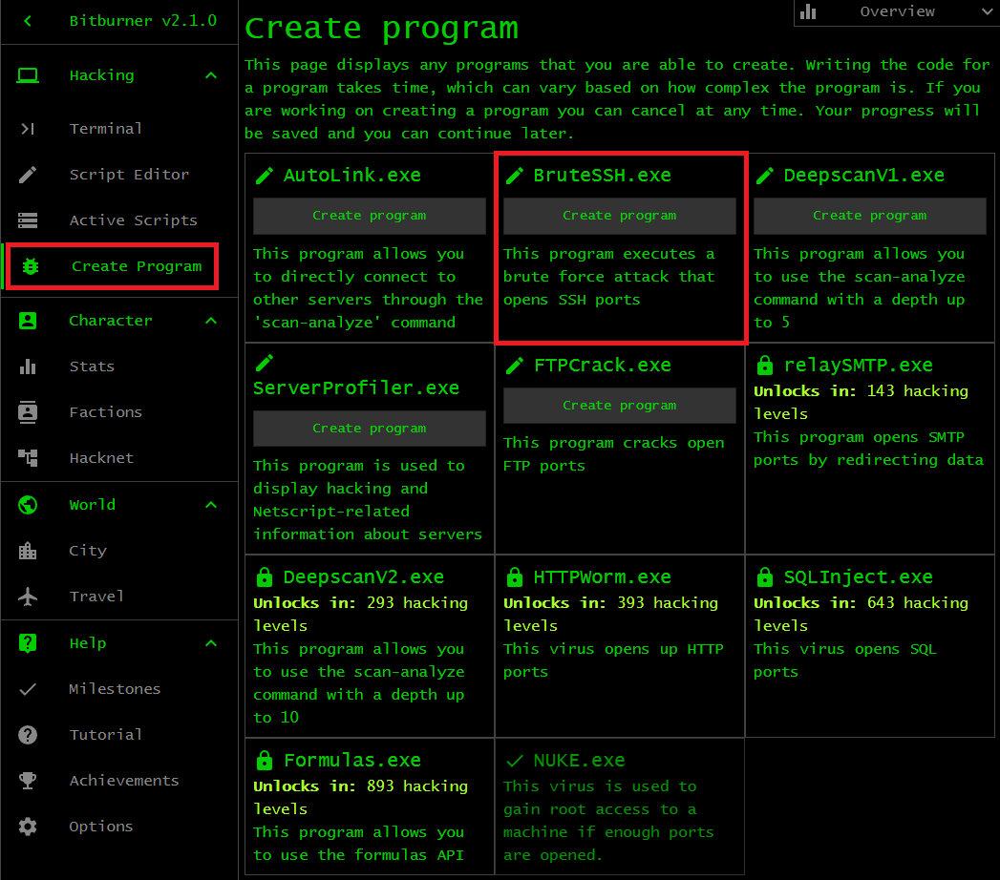
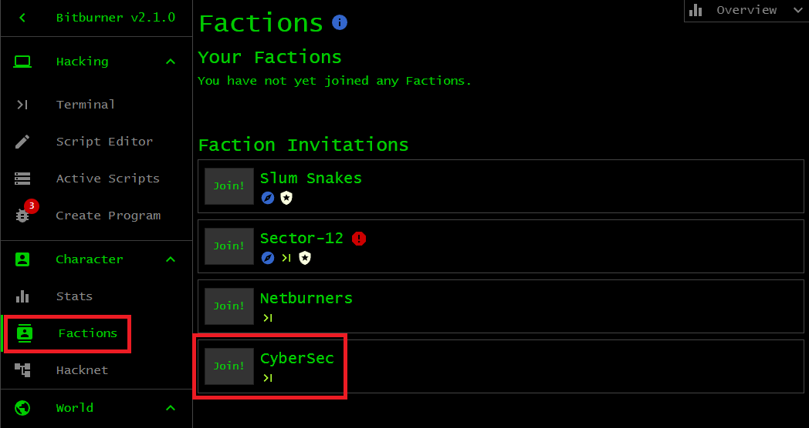
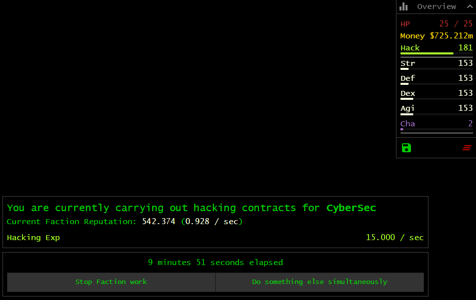
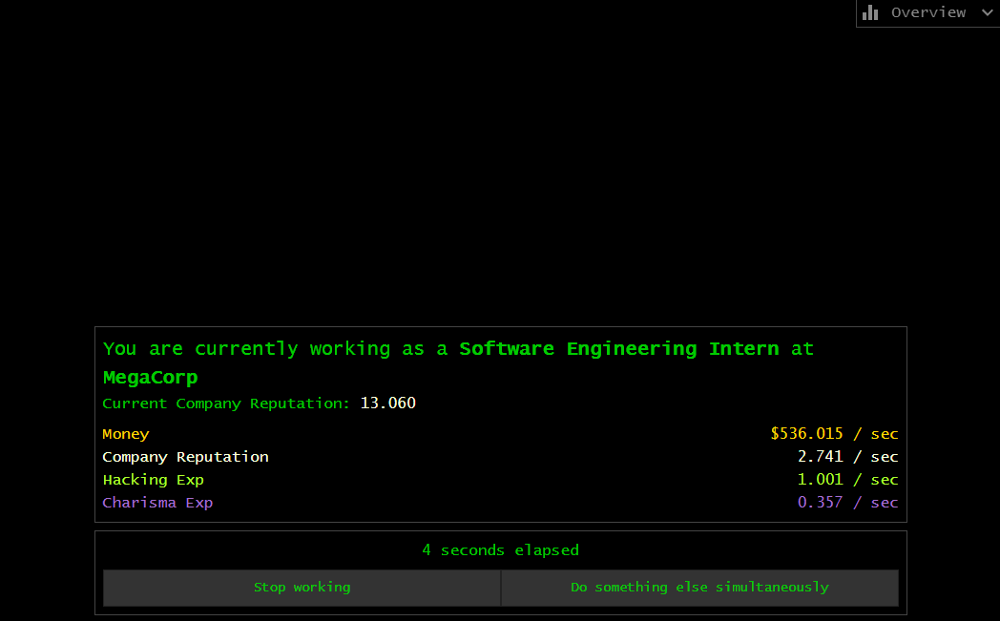
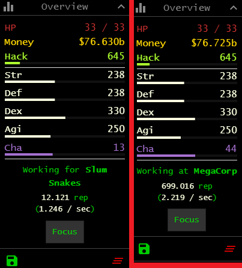
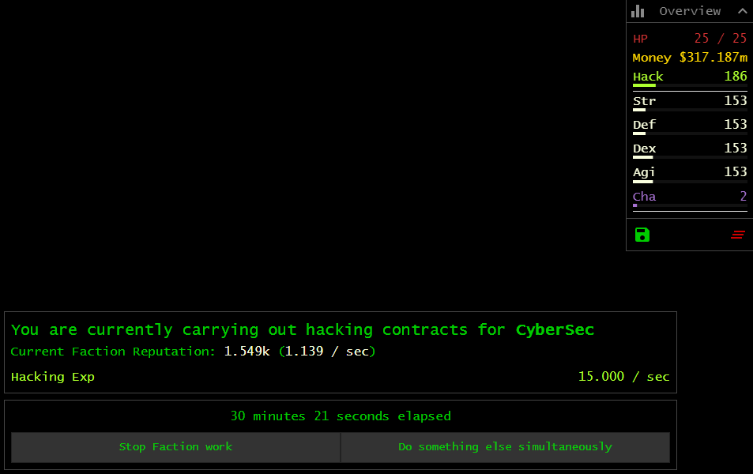
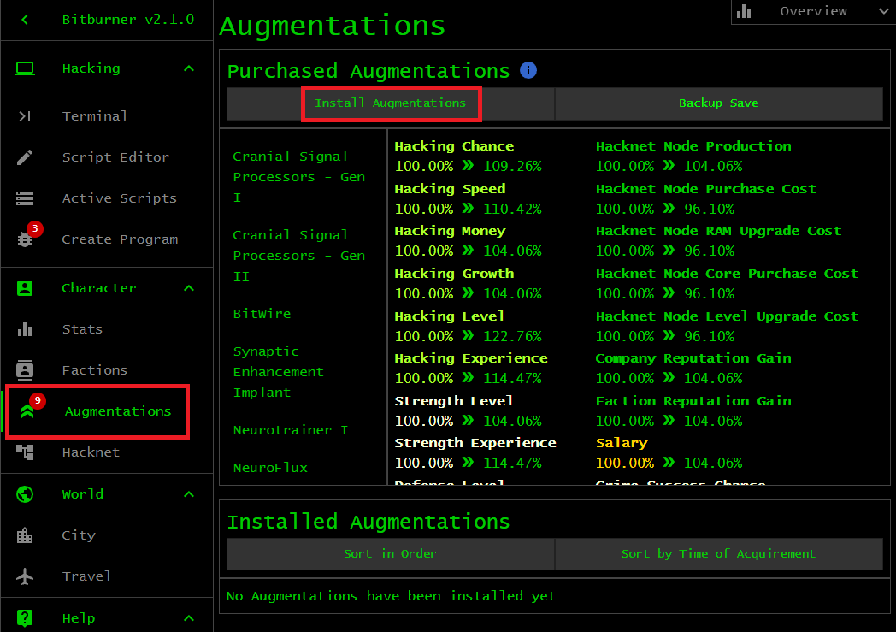

# Programs and factions

When your Hack stat is at least 50, two important events occur.

1. _Programs._ First, you can create various programs to assist with certain
   aspects of your hacking.
1. _Factions._ Second, you would receive invitations from various early-game
   [factions](https://bitburner-official.readthedocs.io/en/latest/basicgameplay/factions.html).

This chapter shows you ways to obtain various programs to help with your hacking
as well as exploration of the game. You will learn about factions and why they
are important in the game.

## Programs

Programs are important as they help you to gain root access to various servers.
Some programs are designed to open various ports on a server. Other programs
allow you to take control of a server and run scripts on the server. Finally,
some programs help you to analyze and determine which servers to hack.

You started the game with the `NUKE.exe` program, which allows you to gain root
access on a server provided that a certain number of ports are open on that
server. From 50 Hack onward, you can create two other programs: `BruteSSH.exe`
and `AutoLink.exe`. The `BruteSSH.exe` program opens up the SSH port on a
server, paving the way for the `NUKE.exe` program to take control of the server.
The `AutoLink.exe` program can be used to directly connect to a server by
point-and-click. Run the
[`scan-analyze`](https://bitburner-official.readthedocs.io/en/latest/basicgameplay/terminal.html#scan-analyze)
command to provide a list of nearby servers. If you have the `AutoLink.exe`
program, you could simply click on a server name to connect to that server,
instead of typing

```sh
$ connect [serverName]
```

at the terminal.

To create a program, click on the <kbd>Create Program</kbd> tab and choose a
program that can be created. Some other programs are locked at the moment. These
programs require a higher Hack stat to unlock. Locate the `BruteSSH.exe` program
and click on <kbd>Create program</kbd> to start working on that program. Let the
game run for a few minutes while the program is being created. When the
`BruteSSH.exe` program is completed, work on the `AutoLink.exe` program. Again,
let the game run for about 10 minutes or more for the program to be 100%
complete.



A drawback of creating a program is the amount of time you must wait for the
program to be 100% complete. The process can be expedited by purchasing programs
via the dark web. You should have already bought the TOR router, which grants
you access to the dark web. The following terminal session:

```sh
$ buy -l
BruteSSH.exe - $500.000k - Opens up SSH Ports.
FTPCrack.exe - $1.500m - Opens up FTP Ports.
relaySMTP.exe - $5.000m - Opens up SMTP Ports.
HTTPWorm.exe - $30.000m - Opens up HTTP Ports.
SQLInject.exe - $250.000m - Opens up SQL Ports.
ServerProfiler.exe - $500.000k - Displays detailed information about a server.
DeepscanV1.exe - $500.000k - Enables 'scan-analyze' with a depth up to 5.
DeepscanV2.exe - $25.000m - Enables 'scan-analyze' with a depth up to 10.
AutoLink.exe - $1.000m - Enables direct connect via 'scan-analyze'.
Formulas.exe - $5.000b - Unlock access to the formulas API.
```

uses the
[`buy`](https://bitburner-official.readthedocs.io/en/latest/basicgameplay/terminal.html#buy)
command to show all programs (and their respective costs) you can purchase via
the dark web. At the moment, the most important programs to buy are
`BruteSSH.exe`, `FTPCrack.exe`, `relaySMTP.exe`, and `HTTPWorm.exe`. These four
programs, together with `NUKE.exe`, would allow you to hack many more servers.
Purchase the above four programs as follows:

```sh
$ buy BruteSSH.exe; buy FTPCrack.exe; buy relaySMTP.exe; buy HTTPWorm.exe
You have purchased the BruteSSH.exe program. The new program can be found on your home computer.
You have purchased the FTPCrack.exe program. The new program can be found on your home computer.
You have purchased the relaySMTP.exe program. The new program can be found on your home computer.
You have purchased the HTTPWorm.exe program. The new program can be found on your home computer.
```

Notice the use of the semicolon `;` to chain a bunch of commands. If necessary,
wait until you have accumulated enough money to buy the above four programs.
Purchase the fifth program, i.e. `SQLInject.exe`, whenever you have sufficient
funds. The five programs `BruteSSH.exe`, `FTPCrack.exe`, `HTTPWorm.exe`,
`relaySMTP.exe`, and `SQLInject.exe` are collectively known as the _port
openers_. Each of these programs allows you to open one port on a world server.

> **Problem 1.** Click on the tab <kbd>Create Program</kbd> to show a list of
> all programs available at the moment. Some of them you can create, while the
> rest are locked until you have the required Hack stat. The programs are also
> available for purchase via the dark web. Read the description of each program
> to see whether you can work out what the program does.

## Factions

The second important event after having at least 50 Hack is receiving an
invitation from one of three early-game
[factions](https://bitburner-official.readthedocs.io/en/latest/basicgameplay/factions.html).
You join a faction primarily for the following purposes:

1. Raise your reputation within the faction. Reputation is important because it
   unlocks items in the faction's shop.
1. Buy one or more equipment that temporarily boost your stats. Stat-boosting
   items allow you to generate even more money or rapidly raise your stats.

At 50 Hack, you should receive an invitation from one of these factions:
CyberSec, Netburners, Tian Di Hui. Depending on the levels of your combat stats
and the amount of money you have, you might also receive an invitation from Slum
Snakes. Joining a faction might prevent you from joining some other factions,
but such a restriction is part of a small number of factions. The majority of
factions does not limit you from being a member of another faction.

Let's join the faction CyberSec. You should have received a message from this
faction, stating the conditions for how to join the faction. You can read the
message from your `home` server:

```sh
# Return to your home server if you are not there already.
$ home

# List all files available at top-level.
$ ls

# View the content of the file "csec-test.msg".
$ cat csec-test.msg
```

The message essentially says that you must pass a test from this faction by
installing a backdoor on the faction's server, i.e. `CSEC`. The process is
straightforward. Use
[`scan-analyze 3`](https://bitburner-official.readthedocs.io/en/latest/basicgameplay/terminal.html#scan-analyze)
to locate `CSEC`, connect to the server, open a port, gain root access, and
install a backdoor. If you already have the `AutoLink.exe` program, clicking on
the name of a server should immediately connect you to the server, instead of
using the
[`connect`](https://bitburner-official.readthedocs.io/en/latest/basicgameplay/terminal.html#connect)
command. In the example below, the `CSEC` server is two hops away from your
`home` server, the intermediate node being `hong-fang-tea`. Take a note of the
network tree reported by
[`scan-analyze`](https://bitburner-official.readthedocs.io/en/latest/basicgameplay/terminal.html#scan-analyze)
for your playthrough. Connect to one or more intermediate servers on your way to
`CSEC`.

```sh
# All servers at most 3 hops from home.
$ scan-analyze 3

# Connect to the server hong-fang-tea, then connect to CSEC.
$ connect hong-fang-tea
$ connect CSEC

# Use the analyze command to determine how many ports to open on CSEC. Take note
# of the Hack requirement to install a backdoor.  You cannot install a backdoor
# on the server if your Hack stat is lower than the required hacking skill.
$ analyze
Analyzing system...
[||||||||||||||||||||||||||||||||||||||||||||||||||]
CSEC:
Organization name: CyberSec
Root Access: NO
Can run scripts on this host: NO
RAM: 8.00GB
Backdoor: NO
Required hacking skill for hack() and backdoor: 53
Server security level: 1.000
Chance to hack: 81.96%
Time to hack: 13.993 seconds
Total money available on server: $0.000
Required number of open ports for NUKE: 1
SSH port: Closed
FTP port: Closed
SMTP port: Closed
HTTP port: Closed
SQL port: Closed

# Open the SSH port on CSEC.
$ run BruteSSH.exe
Opened SSH Port(22)!

# Gain root access to CSEC.
$ run NUKE.exe
NUKE successful! Gained root access to CSEC
You can now run scripts on this server.

# Install a backdoor on CSEC.
$ backdoor
[||||||||||||||||||||||||||||||||||||||||||||||||||]
Backdoor on 'CSEC' successful!

# Return to your home server.
$ home
Connected to home
```

Wait a while to receive an invitation from the faction CyberSec. Click on the
<kbd>Factions</kbd> tab, locate the name of CyberSec, and click
<kbd>Join!</kbd>. Click on <kbd>Details</kbd> for further information about
CyberSec. Refer to the image below.



Each faction has various
[Augmentations](https://bitburner-official.readthedocs.io/en/latest/basicgameplay/augmentations.html),
items that can be installed on your avatar to enhance various attributes. An
enhancement is given in terms of a multiplier. For example, an Augmentation
might add 1% to your hack chance, making it more likely for a hack to be
successful. Augmentations can be unlocked by increasing your reputation within a
faction. Click on the <kbd>Augments</kbd> button for more information about all
Augmentations on offer from CyberSec. When you are ready to work for CyberSec,
click the <kbd>Back</kbd> button. One way to increase your reputation is by
completing hacking contracts for the faction. Click on the <kbd>Hacking
Contracts</kbd> button to start working for CyberSec. This would earn you
reputation within CyberSec as well as Hack XP. Let the game run for an hour or
more. You can also click on the button <kbd>Do something else
simultaneously</kbd> to work on a side project, while you earn Hack XP and a
reduced rate of reputation.



## Reputation

Reputation can be earned by working for a company or faction. You want to raise
your reputation within a company to fulfil one of two objectives:

1. Be able to apply for a promotion to a job that pays better and/or allows you
   to earn more stat XP per second.
1. To receive an invitation from a specific faction. Most companies have their
   own respective factions.

Raising your reputation within a faction would satisfy one of two criteria that
govern whether you can purchase items from the faction's shop. Apart from the
reputation requirement, most items in a faction's shop cost a massive amount of
money.

Each faction and company offers various types of work. Faction work is divided
into three categories:

1. Hacking contracts
1. Field work
1. Security work

Note that some factions offer all or a combination of these three types of work.
Company work is divided into five categories:

1. Business job
1. Software job
1. IT job
1. Security job
1. Miscellaneous job

A miscellaneous job is part-time work, a position either as a waiter or general
employee. Some companies offer one or a combination of these types of work.

The above image shows the rate at which you are earning reputation within
CyberSec. Reputation can be earned within a faction as well as within a company.
You can earn reputation in one of two ways: passive and active. Upon joining a
faction or company, you immediately start to earn reputation, albeit rather
slowly. This is passive reputation. To increase the rate at which you earn
reputation, work for the faction or company. You are actively working for a
faction or company when you are focused on a job. How do you know you are
focused on a task? You are focused on a faction task when you see a focus screen
like in the above image. The image below shows a screen that illustrates that
you are focused on a company task.



Both images above show a button that says <kbd>Do something else
simultaneously</kbd>. Click on that button and your focus would be taken away
from the task, and you should see something like the left or right panel of the
following image. (The left panel shows your unfocused work for the faction Slum
Snakes, not CyberSec.) You are still actively earning reputation, but your
earning rate is lowered because you are being penalized for not focusing on the
task. One of the factions has an Augmentation that removes the penalty for not
focusing on a task; see the chapter [_Faction progression_](faction.md).



You can only focus on one task at a time. Suppose you click the button <kbd>Do
something else simultaneously</kbd>, then you go to The Slums and commit a
crime. Your focus would be taken away from the faction/company work. A screen
would popup to show you are currently focusing on a crime. Now you are back to
passively earning faction or company reputation.

## Share

Sharing your `home` server with a faction can boost the rate at which you gain
reputation within the faction. The more RAM your `home` server has, the more you
can share with a faction, and the higher is the rate at which you gain
reputation within the faction.

As shown in one of the images from the section [_Factions_](#factions), you are
earning less than 1 reputation point per second within CyberSec. You require
approximately 18.75k reputation points to unlock all Augmentations from
CyberSec. At this rate, earning those 18.75k reputation points would require
more than 5.61 hours of waiting time. One way of boosting the rate at which you
earn reputation points is by sharing your `home` server with a faction. You
should now have enough money to upgrade `home` to 512GB RAM. Let's share all
available RAM on `home` with CyberSec. First, you must kill all programs that
are running on `home`:

```sh
# Print out information about all scripts running on home server.
$ top
Script                                  PID       Threads         RAM Usage
hack.js                                 1         53              127.20GB

# Kill all scripts that are running on home server.
$ killall
Killing all running scripts

# The amount of free RAM on home server.
$ free
Total:     512.00GB
Used:         0.00B (0.00%)
Available: 512.00GB
```

Use the function
[`ns.share()`](https://github.com/bitburner-official/bitburner-src/blob/dev/markdown/bitburner.ns.share.md)
to share your `home` server with CyberSec. Place this function inside an
infinite loop as shown in the following script:

```js
/**
 * Share our home server with a faction.  Doing so would increase our
 * reputation gains within that faction.  Run this script using as high a number
 * of threads as possible to increase our reputation gains even further.
 *
 * Usage: run share.js -t [numThread]
 * Example: run share.js -t 3
 *
 * @param ns The Netscript API.
 */
export async function main(ns) {
    for (;;) {
        await ns.share();
    }
}
```

Save the above code in a file called `share.js`. The above code is also
available in the [share script](script/share.js). Note the amount of RAM
required to run the script:

```sh
$ mem share.js
This script requires 4.00GB of RAM to run for 1 thread(s)
  2.40GB | share (fn)
  1.60GB | baseCost (misc)
```

In total, you can use $\lfloor 512 / 4 \rfloor = 128$ threads to run the script
`share.js` on `home`:

```sh
$ run share.js -t 128
Running script with 128 thread(s), pid 4 and args: [].
```

As shown in the image below, when sharing your `home` server you earn reputation
points with CyberSec at a rate of 1.139 per second. The waiting time has been
reduced to about 4.57 hours, saving you about 1.04 hours of waiting. The more
RAM your `home` server has, the more RAM you can share with a faction to further
boost the rate at which you earn reputation points. However, do note that there
is a point of diminishing return. There is a point at which sharing more RAM
with a faction would result in a tiny (or even negligible) boost to the rate at
which you earn reputation points. For maximum benefit from the function
[`ns.share()`](https://github.com/bitburner-official/bitburner-src/blob/dev/markdown/bitburner.ns.share.md),
focus on a faction work while you are sharing your `home` server with the
faction. The function can figure out which faction you are actively working for,
because you are allowed to focus on one task at a time. For now, focus on your
work for CyberSec. Let your game run until you have earned the required
reputation points to unlock all Augmentations from CyberSec.



> **Problem.** Write a script that launches the [share script](script/share.js)
> on your `home` server. The launcher should use as many threads to run the
> share script as the RAM of `home` allows.

## Augmentation

An
[Augmentation](https://bitburner-official.readthedocs.io/en/latest/basicgameplay/augmentations.html)
is an implant that has one of three effects:

1. A percentage boost to one or more of your stats.
1. Grants you an item that helps with your hacking or exploration of the game.
1. Triggers an event in the game.

Currently, the only path to acquiring Augmentations is to join a faction and
earn enough reputation within the faction to unlock one or more of the faction's
Augmentations. Different factions have different Augmentations. Joining one
faction can prevent you from joining another faction, but such a membership
restriction is limited to a small number of factions. You will find that the
majority of factions do not prohibit you from being a member of any other
faction.

Early in the game, you should join an early-game faction. CyberSec is one such
faction. Perform hacking contracts (or field work) to earn reputation within the
faction and when possible purchase one or more of the faction's Augmentations.
In the case of CyberSec, you can purchase these Augmentations:

1. `NeuroFlux Governor - Level 1`
1. `BitWire`
1. `Synaptic Enhancement Implant`
1. `Cranial Signal Processors - Gen I`
1. `Cranial Signal Processors - Gen II`
1. `Neurotrainer I`

`NeuroFlux Governor` can be bought from any faction, not just CyberSec.
Initially, the price multiplier is 1. Purchasing an Augmentation would raise the
price multiplier by a certain value, hence increasing the cost of purchasing
another Augmentation. As you buy more and more Augmentations, the price
multiplier would be higher and higher and you must pay more for the next
Augmentation. For example, after purchasing `NeuroFlux Governor - Level 1`, the
price multiplier would rise to 1.9 or thereabout.

Installing an Augmentation would raise or decrease one or more of your stat
multipliers. The effect of a boost to stat multiplier depends on the
Augmentations you install. Some Augmentations boost your hacking skills, others
boost your other stats, while some boost the amount of money you gain from
certain actions. The downside is a soft reset where you would lose most of your
progress, including your stat and skill points. All of your stats would be reset
to 1, your HP would be reset to 10, and your money would be reset to $1k (or
another default value). However, after installing an Augmentation you would keep
the following:

1. Each Augmentation you have previously installed.
1. All scripts on your `home` server.
1. All upgrades you have made to your `home` server.
1. Your account at the World Stock Exchange.
1. Your access to the TIX APIs.

Each Augmentation installed would result in a soft reset. Therefore it makes
sense to purchase a bunch of Augmentations from a faction and then install those
Augmentations all at once. Save up a few hundred million dollars and purchase
the most expensive Augmentation from CyberSec. You might want to click the
button <kbd>Sort by Cost</kbd> to help you choose the most expensive
Augmentation. Buying one Augmentation would increase the price multiplier, but
only for the less expensive Augmentations that you have not yet purchased.
Repeat the purchasing strategy until you have purchased all Augmentations from
CyberSec. Some Augmentations have pre-requisites. For example, the pre-requisite
of `Cranial Signal Processors - Gen II` is `Cranial Signal Processors - Gen I`.
Purchase all pre-requisites first before you are allowed to purchase the
particular Augmentation. Note that `NeuroFlux Governor` can be levelled up
infinitely. Use the money available to level up `NeuroFlux Governor` as high as
you can. Use any left over money to upgrade your `home` server, either RAM or
Cores or both. You would lose all money after installing the Augmentations, so
you might as well spend the money now. Then install all Augmentations at once.
The process to install Augmentations is as follows. Click on the
<kbd>Augmentations</kbd> tab, review the changes to your stat multipliers, and
click on <kbd>Install Augmentations</kbd>. Refer to the image below.



[[TOC](README.md "Table of Contents")] [[Previous](script.md "First script")]
[[Next](reboot.md "After the first reboot")]

[](http://creativecommons.org/licenses/by-nc-sa/4.0/)
