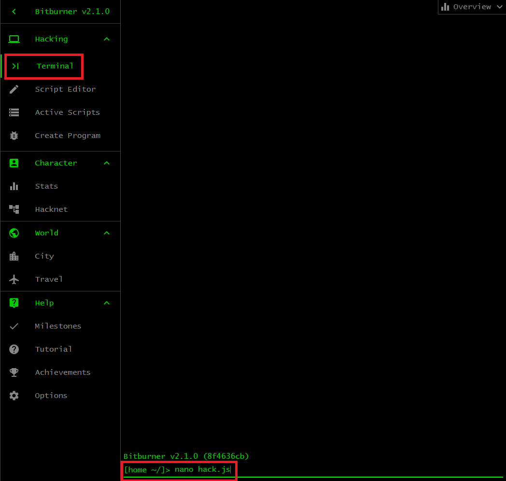
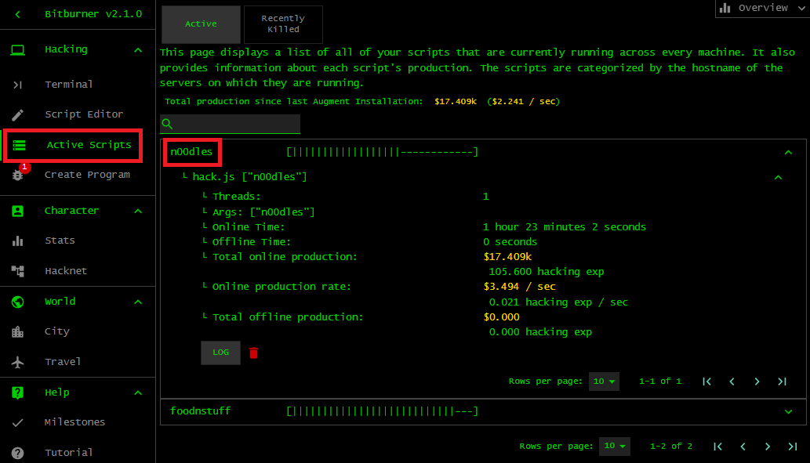
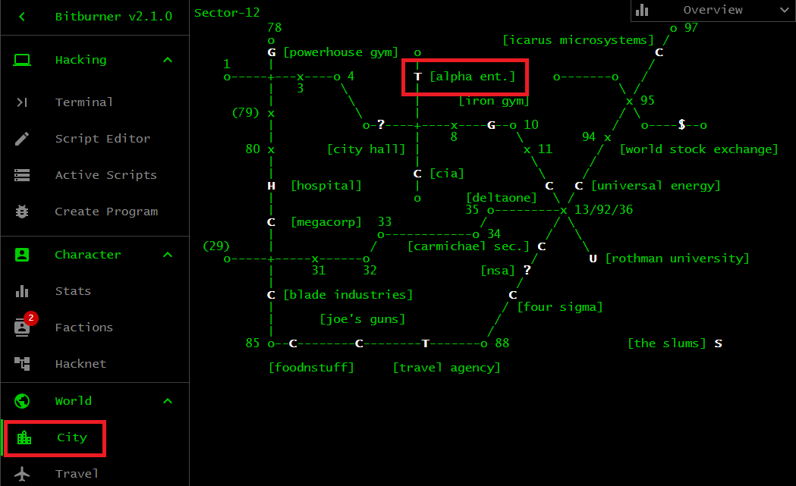

# First script

The overall theme of Bitburner is hacking. You write JavaScript programs, also
called _scripts_, to perform various kinds of hacking. The form of hacking you
will encounter again and again is stealing money from a server. This chapter
shows you how to write an early hacking script. You will also learn how to use
the script to hack various
[servers](https://bitburner-official.readthedocs.io/en/latest/basicgameplay/servers.html)
found in the game world.

## `hack.js`

Hacking a server provides a source of passive income, in addition to other
sources of income covered in the chapter [_Starting out_](start.md). Below is a
general-purpose script to hack a server. It continuously probes a target server
to determine the target's security level and the amount of money on the target.
If the target's security level is too high, the script weakens the target. If
the target has too little money, let the server grow and increase the amount of
money. In case the target's security level is low enough and there is a decent
amount of money on the server, hack the target and steal some of its money. The
script is not meant to be efficient at generating money or increasing your Hack
stat. Its purpose is to serve as a bare-bones script upon which you write your
own possibly more efficient script. The full script can also be found
[here](script/hack.js).

```js
/**
 * NOTE: Assume that we have root access on the target server.
 *
 * Hack a server and steal its money.  We weaken the server's security as
 * necessary, grow the server in case the amount of money on the server is
 * below our threshold, and hack the server when all conditions are met.  We
 * want one command line argument, i.e. the name of the server to hack.
 *
 * Usage: run hack.js [targetServer]
 * Example: run hack.js n00dles
 *
 * @param ns The Netscript API.
 */
export async function main(ns) {
    // The target server, i.e. the server to hack.
    const target = ns.args[0];
    // How much money a server should have before we hack it.  Even if the
    // server is bankrupt, successfully hacking it would increase our Hack XP,
    // although we would not receive any money.  Set the money threshold at 75%
    // of the server's maximum money.
    const money_threshold = Math.floor(ns.getServerMaxMoney(target) * 0.75);
    // The threshold for the server's security level.  If the target's
    // security level is higher than the threshold, weaken the target
    // before doing anything else.
    const security_threshold = ns.getServerMinSecurityLevel(target) + 5;
    // Continuously hack/grow/weaken the target server.
    for (;;) {
        const money = ns.getServerMoneyAvailable(target);
        if (ns.getServerSecurityLevel(target) > security_threshold) {
            await ns.weaken(target);
        } else if (money < money_threshold) {
            await ns.grow(target);
        } else {
            await ns.hack(target);
        }
    }
}
```

Each of the functions
[`ns.grow()`](https://github.com/bitburner-official/bitburner-src/blob/dev/markdown/bitburner.ns.grow.md)
and
[`ns.hack()`](https://github.com/bitburner-official/bitburner-src/blob/dev/markdown/bitburner.ns.hack.md)
increases the security level of the target server. For this reason, the script
constantly monitors the security level of the target and weakens the security
level as necessary.



Save the above code in a script called `hack.js`. As shown in the above image,
click on the
[<kbd>Terminal</kbd>](https://bitburner-official.readthedocs.io/en/latest/basicgameplay/terminal.html)
tab and type

```sh
$ nano hack.js
```

to open a text editor. Copy and paste the content of the above script to the
text editor. Click <kbd>Save</kbd> or type <kbd>Ctrl</kbd> + <kbd>S</kbd>, then
locate and click the <kbd>X</kbd> button to close the file. Type `ls` at the
[terminal](https://bitburner-official.readthedocs.io/en/latest/basicgameplay/terminal.html)
and you should see the script `hack.js` you just created. You can run the script
on your `home` server, but this would take up the valuable small amount of RAM
your `home` server has early in the game. Another option is to run the script on
a different world server.

## Hack `n00dles`

It is time to role-play as a botnet master. Your objective is to pool the
resources of as many world servers as possible to hack a common target. It is
generally more effective to let a bunch of servers hack one common server, than
to let each server hack a different target. Let's find out which servers you can
use. At the
[terminal](https://bitburner-official.readthedocs.io/en/latest/basicgameplay/terminal.html),
run the command

```sh
$ scan-analyze 2
```

to determine all servers that are at most two hops away from your `home` server.
The result of the command
[`scan-analyze`](https://bitburner-official.readthedocs.io/en/latest/basicgameplay/terminal.html#scan-analyze)
is different for each player and each playthrough. Take note of the following
servers: `n00dles` and `foodnstuff`. Each of these two servers requires a Hack
level of 1 in order for you to gain root access to them. Furthermore, both
servers do not require any port to be opened. All of the above means that you
can immediately take control of both servers and hack them to steal money. You
can use the command
[`analyze`](https://bitburner-official.readthedocs.io/en/latest/basicgameplay/terminal.html#analyze)
to obtain various information about the requirements for gaining root access to
a server. You should first connect to a target server, then run
[`analyze`](https://bitburner-official.readthedocs.io/en/latest/basicgameplay/terminal.html#analyze).
Let's connect to `n00dles` and `foodnstuff` and gain root access to each of
them.

```sh
# Connect to the server n00dles.
$ connect n00dles
Connected to n00dles

# Obtain vital information about the server.
$ analyze
Analyzing system...
[||||||||||||||||||||||||||||||||||||||||||||||||||]
n00dles:
Organization name: Noodle Bar
Root Access: NO
Can run scripts on this host: NO
RAM: 4.00GB
Backdoor: NO
Required hacking skill for hack() and backdoor: 1
Server security level: 1.000
Chance to hack: 42.43%
Time to hack: 49.264 seconds
Total money available on server: $70.000k
Required number of open ports for NUKE: 0
SSH port: Closed
FTP port: Closed
SMTP port: Closed
HTTP port: Closed
SQL port: Closed

# No need to open any ports. You can immediately gain root access to the server.
$ run NUKE.exe
NUKE successful! Gained root access to n00dles
You can now run scripts on this server.

# Return to your home server.
$ home
Connected to home

# Repeat the above steps, but for the server foodnstuff.
$ connect foodnstuff
Connected to foodnstuff
$ analyze
Analyzing system...
[||||||||||||||||||||||||||||||||||||||||||||||||||]
foodnstuff:
Organization name: FoodNStuff
Root Access: NO
Can run scripts on this host: NO
RAM: 16.00GB
Backdoor: NO
Required hacking skill for hack() and backdoor: 1
Server security level: 10.000
Chance to hack: 38.57%
Time to hack: 51.470 seconds
Total money available on server: $2.000m
Required number of open ports for NUKE: 0
SSH port: Closed
FTP port: Closed
SMTP port: Closed
HTTP port: Closed
SQL port: Closed
$ run NUKE.exe
NUKE successful! Gained root access to foodnstuff
You can now run scripts on this server.
$ home
Connected to home
```

Next, copy the script `hack.js` over to `n00dles` and `foodnstuff` and use each
server to hack `n00dles`. You need to know the amount of RAM your script
requires to run on a server. If a target server has less RAM than the amount
required by the script `hack.js`, then the server would not be able to run the
script. The following command

```sh
$ mem hack.js
This script requires 2.40GB of RAM to run for 1 thread(s)
  1.60GB | baseCost (misc)
150.00MB | weaken (fn)
150.00MB | grow (fn)
100.00MB | getServerMaxMoney (fn)
100.00MB | getServerMinSecurityLevel (fn)
100.00MB | getServerMoneyAvailable (fn)
100.00MB | getServerSecurityLevel (fn)
100.00MB | hack (fn)
```

shows that the script `hack.js` requires 2.4GB RAM to run. When you were
analyzing the server `n00dles`, you noticed that it has 4GB RAM so you can run
the script using at most 1 thread. Furthermore, your analysis of `foodnstuff`
shows that the server has 16GB RAM, which allows you to run the script using at
most $\lfloor 16 / 2.4 \rfloor = 6$ threads. The more threads that are used to
run your script, the better because the result of your script (e.g. the amount
of money you steal) is multiplied by the number of threads. Running your script
using 6 threads translates to multiplying the amount of money you steal by 6.
Use the command
[`scp`](https://bitburner-official.readthedocs.io/en/latest/basicgameplay/terminal.html#scp)
to copy `hack.js` over to the above servers and use the above number of threads
to run the script on the respective servers. As shown in the
[terminal](https://bitburner-official.readthedocs.io/en/latest/basicgameplay/terminal.html)
session below, your hack script should target `n00dles`. Early in the game, you
should concentrate on hacking one target server. The server `n00dles` is always
a good choice to target to raise your Hack stat and earn some money. Later on,
you might want target a different server.

```sh
$ scp hack.js n00dles
hack.js copied over to n00dles
$ connect n00dles
Connected to n00dles
$ run hack.js n00dles
Running script with 1 thread(s), pid 1 and args: ["n00dles"].
$ home
Connected to home
$ scp hack.js foodnstuff
hack.js copied over to foodnstuff
$ connect foodnstuff
Connected to foodnstuff
$ run hack.js -t 6 n00dles
Running script with 6 thread(s), pid 2 and args: ["n00dles"].
$ home
Connected to home
```

To check on the progress of your script, click on the <kbd>Active Scripts</kbd>
tab and locate the name of a server where your script is running. Then click on
the name of a script that is running on that server. Click the button
<kbd>LOG</kbd> to view a log of the running script. Refer to the image below.



Use the command
[`scan-analyze`](https://bitburner-official.readthedocs.io/en/latest/basicgameplay/terminal.html#scan-analyze)
to help you find other servers that can be redirected to hack `n00dles`. For the
moment, look for servers that do not require a port to be opened in order to run
`NUKE.exe` on them. Consider the servers `sigma-cosmetics` and `joesguns`
because they require a relatively low Hack stat. Wait until your Hack stat meets
the Hack requirements of these servers. Then gain root access to the above
servers and use them to hack `n00dles`. Remember to first
[`scp`](https://bitburner-official.readthedocs.io/en/latest/basicgameplay/terminal.html#scp)
your script `hack.js` over to each server and run the script using as many
threads as the server allows.

## Upgrade `home`

Your `home` server can also be used to hack `n00dles`. As shown in the following
[terminal](https://bitburner-official.readthedocs.io/en/latest/basicgameplay/terminal.html)
session:

```sh
$ free
Total:     8.00GB
Used:       0.00B (0.00%)
Available: 8.00GB
```

you start the game with 8GB RAM. The passive income you generated from your
Hacknet nodes, committing <kbd>Homicide</kbd> in The Slums, and from hacking
`n00dles` should have now accumulated to $50m or more. It is time to upgrade the
RAM of `home`. Click on the <kbd>City</kbd> tab to bring up the city map. Find
the location of Alpha Enterprises, as shown in the image below, and click on the
`T` icon to bring up the page of the company. You need approximately $46.146m to
upgrade `home` to 128GB RAM, leaving you plenty of money to purchase the TOR
router. The TOR router will come in handy later on when you need to purchase
various programs to help you progress. For the moment, the following
[terminal](https://bitburner-official.readthedocs.io/en/latest/basicgameplay/terminal.html)
session:

```sh
$ free
Total:     128.00GB
Used:         0.00B (0.00%)
Available: 128.00GB
```

shows that your `home` server now has 128GB RAM.



Let's put those spare RAM to good use. It is time to generate even more passive
income by using `home` to hack `n00dles`. You already know that the script
`hack.js` requires 2.4GB RAM to run, meaning that you can use
$\lfloor 128 / 2.4 \rfloor = 53$ threads to run `hack.js` on `home` and target
`n00dles`:

```sh
$ run hack.js -t 53 n00dles
Running script with 53 thread(s), pid 5 and args: ["n00dles"].
```

While your script is hacking `n00dles`, go back to Rothman University and study
the free computer science course to raise your Hack stat. You want at least 50
Hack. The reason will be explained in the next chapter.

[[TOC](README.md "Table of Contents")] [[Previous](start.md "Starting out")]
[[Next](program.md "Programs and factions")]

[](http://creativecommons.org/licenses/by-nc-sa/4.0/)
