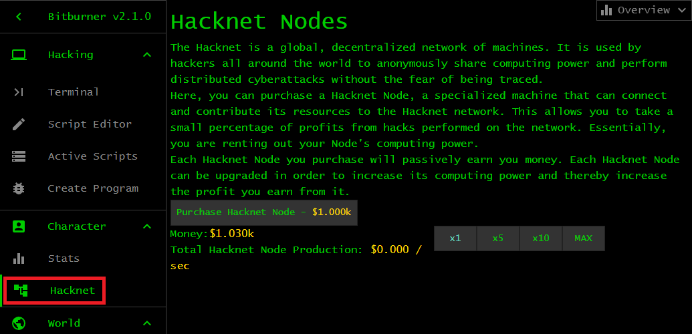
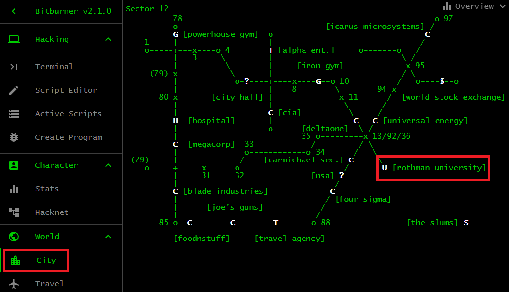
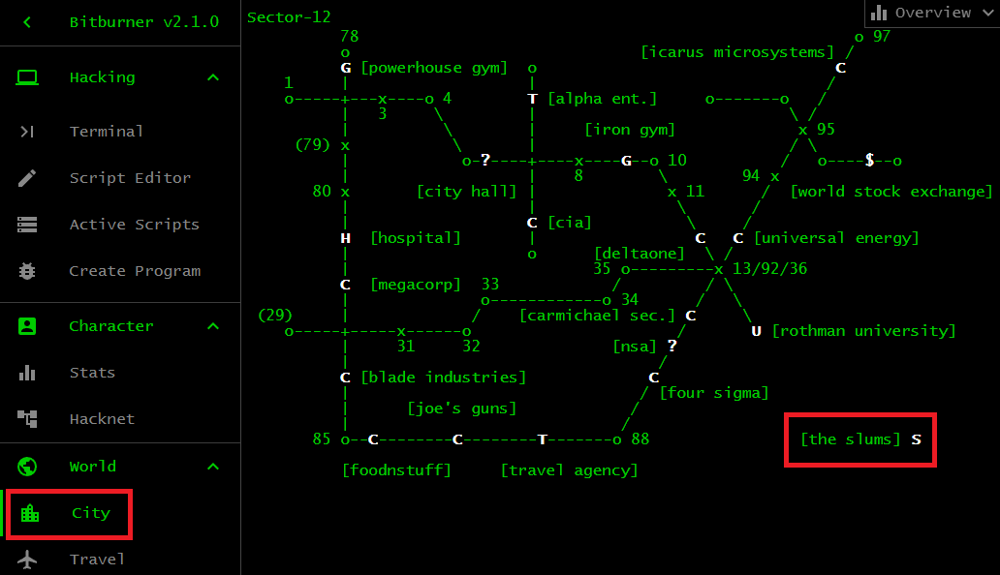

# Starting out

You are in a city called Sector-12, located in a world of six cities. You have
$1k and level 1 in all
[stats](https://bitburner-official.readthedocs.io/en/latest/basicgameplay/stats.html).
The two most important objectives currently are:

1. Generate income.
1. Raise your Hack stat.

This chapter shows you basic ways to increase your stats and earn money.

## Hacknet

Income can be passively generated by using the $1k to purchase a Hacknet node.
Refer to the image below. Your Hacknet node starts generating passive income as
soon as it is purchased. Each Hacknet node has three stats: Level, RAM, and
Cores. The production of a node is the rate at which income is passively
generated, given in terms of dollars per second. Raising the three stats would
raise the production rate. Level is the level of your node. Money is required to
raise the Level of a node, each new Level contributes a fixed amount to the
node's production rate. The maximum Level of each node is 200. RAM refers to the
amount of memory available to run a node. Adding more RAM to a node would
increase the node's production rate by a fixed amount. Each node can have a
maximum of 64GB RAM. Cores means the number of processing cores of a node. Each
node can have at most 16 Cores. Adding another Core to a node would raise its
production rate. In general, the higher is the Level, RAM, or Cores the more
money it costs to raise one of these stats. Plan on purchasing one or more nodes
to generate even more passive income. Let your Hacknet nodes run while you raise
your Hack stat.

## Study

To raise your Hack stat, click on the <kbd>City</kbd> tab and locate Rothman
University on the city map. Refer to the image below. Choose the option
<kbd>Study Computer Science (free)</kbd> to start gaining Hack XP. Focus on
studying for ten or more minutes to raise your Hack stat to about 10 or higher.
When you have 10 Hack or more, stop taking the course to focus on another task.

## Work

Income can also be generated by working at a
[company](https://bitburner-official.readthedocs.io/en/latest/basicgameplay/companies.html).
Jobs at a company are divided into four categories:

1. Business
1. IT
1. Security
1. Software

The higher paying jobs generally require high Hack and/or high Charisma. A high
Hack stat is required to be accepted in an IT or Software job. A Hack stat
around 255 or thereabout allows you to apply for an IT or Software job at any
company that offers those jobs. Working in an IT or Software job would train
your Hack and Charisma stats. High Charisma is useful to help you land a
Business job. A Business job requires both high Hack and high Charisma. A
Business job usually pays higher than any other job on offer at a company. A
Security job requires high combat stats and high Charisma. Working in a Security
job can train all your stats at once. You also have the option to
[infiltrate](https://bitburner-official.readthedocs.io/en/latest/basicgameplay/infiltration.html)
a company, a means of earning a large sum of money early in the game.

Currently, the following companies have open jobs that suit your low stats:
FoodNStuff and Joe's Guns. Locate FoodNStuff on the city map and choose the
option <kbd>Apply to be an Employee</kbd> and click the button <kbd>Work</kbd>
to start your job. Instead of FoodNStuff, you might want to work at Joe's Guns.
Working at any of these two companies would train your stats (excluding the Hack
stat) and earn you some extra money. Focus on the job for a few minutes to
increase your stats by one or more points. Then click <kbd>Do something else
simultaneously</kbd> to divide your attention between your job and a side
hustle. You have the option of going to The Slums to commit crimes. This is
risky, but yields decent reward early in the game.

## Crime

Every city has an area called The Slums. Refer to the image below. Early in the
game, committing crimes in The Slums is one of the best options to increase your
combat stats and earn money. Your combat stats are Strength, Defense, Dexterity,
and Agility. Among all crimes available in The Slums, on average
<kbd>Homicide</kbd> is the best crime for raising money. Start off with
<kbd>Shoplift</kbd> for a few minutes to train your Agility and Dexterity. Then
move on to <kbd>Mug someone</kbd> for a few minutes to train all your combat
stats at once. The higher are your combat stats, the higher is your chance of
success when committing <kbd>Homicide</kbd>. Aim to have at least 10 points in
each combat stat prior to committing <kbd>Homicide</kbd>. You only gain money if
you successfully committed a crime. On the other hand, you earn stat XP
regardless of whether you fail or succeed. A disadvantage of <kbd>Homicide</kbd>
is that it does not raise your Hack stat. However, one of the main reasons for
committing <kbd>Homicide</kbd> is that on average you earn approximately $1.087m
per minute, an earning rate exceeding that of any other crime. Continue
committing <kbd>Homicide</kbd> until you have earned several millions of
dollars, preferably enough to purchase a few more Hacknet nodes and increase the
Level of each node to about 10.

Wait until you have enough money to purchase additional Hacknet nodes to bring
the total to node x 12. Let the game run for another few hours, or save the game
and exit. Consider upgrading the Level, RAM, and Cores of each node. Every few
hours or so, pump a few points into each of these stats to increase the
production rate of each node. Upgrading the RAM or Cores of a node is generally
more expensive than upgrading the Level. You do not need to max out the RAM and
Cores of each node. Furthermore, do not worry about reaching the maximum Level
for each node. A Level of 50 for each node is decent. A Level of 100 for each
node is ideal.

[[TOC](README.md "Table of Contents")] [[Previous](intro.md "Introduction")]
[[Next](script.md "First script")]

