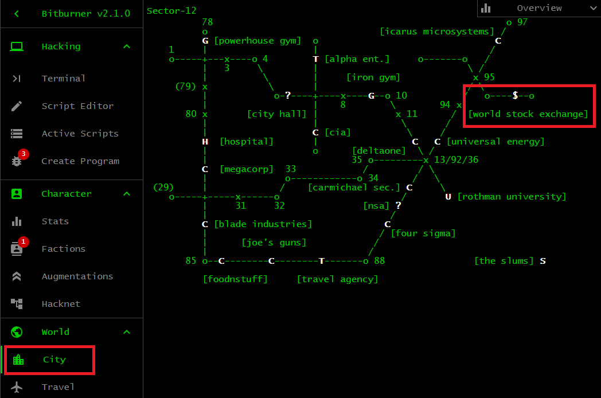

# Stock Market

The
[Stock Market](https://bitburner-official.readthedocs.io/en/latest/basicgameplay/stockmarket.html)
can be a good source of passive income. Depending on how you use it, the Stock
Market can be your personal bank where profits you earn are like interest on
your deposit. To start trading on the Stock Market, you must have an account on
the World Stock Exchange (WSE). Like The Slums, the WSE is available in each
city. Refer to the image below to help you locate the WSE. Click on the dollar
sign icon `$` to load the page for the WSE. As the goal of this guide is to help
you automate as many aspects of the game as possible, the guide will not discuss
manual trading on the Stock Market.



Use the
[Stock Market API](https://github.com/bitburner-official/bitburner-src/blob/dev/markdown/bitburner.tix.md)
to automate your trading. Note that the namespace of the API is
`ns.stock.functionName()`, not `ns.TIX.functionName()`. Automatic trading on the
Stock Market requires a huge initial cost. First, you must spend $200m to
purchase an account on the WSE. The account gives you access to manual trading,
i.e. you must point and click to trade a stock. For an extra $5b, you can
purchase access to the Trade Information eXchange (TIX) API, which allows you to
automate various aspects of your trading on the Stock Market. Spend another $25b
to purchase access to the 4S Market Data TIX API. An extra $1b would buy you
access to the 4S Market Data. Every transaction you make through 4S incurs a
commission fee of $100k. In total, expect to pay $31.2b up front to have access
to all APIs and data relevant to the Stock Market. Your access to the APIs and
data is permanent and do not reset after installing an Augmentation. Despite the
huge initial cost, in the long run trading on the Stock Market can reward you
with much more passive income than the combination of your Hacknet and server
hacking. Every time you trade on the Stock Market, ensure you leave some money
in reserve in case you need money to purchase servers or upgrade your Hacknet
nodes. Refrain from spending all your money gambling on the Stock Market.

> **Problem 1.** Obtain access to all WSE APIs and data. Write a trade bot to
> automate your trading on the Stock Market. For your first trade bot, buy a
> certain number of shares of a stock if you have sufficient funds. Make sure
> not to use all your money to buy shares. Furthermore, sell all shares of a
> stock provided that you can make a profit from the sale.
>
> **Problem 2.** The functions
> [`ns.grow()`](https://github.com/bitburner-official/bitburner-src/blob/dev/markdown/bitburner.ns.grow.md),
> [`ns.hack()`](https://github.com/bitburner-official/bitburner-src/blob/dev/markdown/bitburner.ns.hack.md),
> and
> [`ns.weaken()`](https://github.com/bitburner-official/bitburner-src/blob/dev/markdown/bitburner.ns.weaken.md)
> each has an option that allows you to affect the Stock Market. Modify your
> hack script to affect the Stock Market.
>
> **Problem 3.** Using the modified hack script from the previous exercise,
> every time the script hack/grow/weaken a world server the action would
> somewhat affect the stock of the company/organization that owns the server.
> Use this to your advantage by having each purchased server target a different
> world server. Use the weight function from the section
> [_Your first worm_](reboot.md#your-first-worm) to help you choose a bunch of
> world servers for your pserv farm to target.

## Trade bot, post-4S

Purchase access to all Stock Market data and APIs as soon as possible to reap
the benefit of a fully automated trading script. Your trade bot does not need to
implement any fancy or complicated trading strategy. You are more than welcome
to implement any sophisticated trading strategy you want. In fact, your trading
strategy can be as simple as: Buy low, sell high (aka the BLoSH strategy). It is
how you implement your strategy that determines whether you would make money in
the long run.

The following is an elaboration of the BLoSH strategy. The strategy is meant to
be simple to implement and is not necessarily optimal. You would only be able to
sell shares of a stock in the _Long_ position. You would not be able to unlock
the selling of stocks in the _Short_ position, i.e. shorting a stock, until much
later in the game.

1. The Stock Market updates approximately every 6 seconds. Let's refer to this
   interval as one _tick_ of the Stock Market. Your trade bot should do whatever
   it needs to do, sleep for one tick, and run through your strategy again in
   the next tick.
1. At the start of a tick, sell all shares of a stock that is forecasted to
   decrease in the next tick. How would you know a stock would decrease in the
   next tick? The function
   [`ns.stock.getForecast()`](https://github.com/bitburner-official/bitburner-src/blob/stable/markdown/bitburner.tix.getforecast.md)
   tells you the probability that a stock would increase in the next tick.
   Choose the value 0.5 as the cutoff. If the probability of increase is greater
   than 0.5, then the corresponding stock has more than 50% chance to increase
   in the next tick. Any stock that has a forecast at or below 0.5 is said to be
   _unfavourable_ and is a candidate to be sold. Among all stocks in your
   portfolio, take note of the unfavourable stocks and choose the one having the
   lowest forecast value and that would return a profit upon being sold. If the
   stock of lowest forecast value cannot be sold for a profit, consider the
   stock of second lowest forecast value and see whether it can be sold for a
   profit. Eventually you would either find an unfavourable stock that can be
   sold for a profit, or each of the unfavourable stocks cannot be sold for a
   profit. Selling shares at the start of a tick should provide you with some
   money to purchase shares of other stocks. On the other hand, you might want
   to sell the shares of all unfavourable stocks.
1. Buy shares of the stock having the greatest chance of increase in the next
   tick. Any stock that has a forecast above the cutoff of 0.525 is said to be
   _favourable_. Adjust the cutoff to suit your needs. Of the favourable stocks,
   choose the most favourable stock, i.e. having the greatest chance of increase
   in the next tick. Work out how many more shares of the stock you can
   purchase. If you have bought all shares of the stock, then move on and wait
   for the next tick. On the other hand, you might want to buy shares of
   multiple favourable stocks. You should decide on the minimum amount of funds
   you are willing to spend during each purchase transaction. Let's call this
   minimum funds the _spend threshold_. Each transaction, whether it be a buy or
   a sell, incurs a commission fee of $100k. Set your spend threshold at several
   million dollars, e.g. between $5m and $10m. One way to calculate the amount
   of money to spend on shares is to subtract the spend threshold from your
   current money. Call this amount the _excess money_. If the excess money is at
   least the spend threshold, then use the excess money to purchase shares.
   There are other ways to calculate how much money to spend on shares. For
   example, use a fraction of the excess money.

The above strategy seems reasonble. However, a script that implements the above
strategy would result in you having to spend most or all of your money buying
shares, leaving you with little money left over. The money generated from
selling shares would then be used to buy more shares. Your money would hover
between very low and high, and not generally increase at all. What you need is
some way to tell your trade bot to keep some profit it generates.

Here is one way to ensure your money is never below a dynamically increasing
threshold. Let _reserve_ be the minimum amount of money you should always have.
Initially, your reserve can be a small number or zero. As you make a profit from
selling shares of a stock, add a portion of the profit to your reserve. In this
way, your reserve increases with every sell transaction. Two immediate problems
spring to mind:

1. How much of the profit should be stashed in the reserve?
1. How would the profit be calculated?

Each time you make a profit from selling shares of a stock, stash a fraction of
the profit in the reserve. The fraction to keep should leave you with funds for
purchasing shares of other stocks. For example, consider 10% as the maximum
percentage of the profit to keep. If keeping 10% of the profit would leave you
with less money than your spend threshold, lower the percentage to 9%. And so
on. It might happen that you cannot even keep 1% of the profit. In that case,
keep nothing at all (i.e. zero percent of the profit) for this particular sell
transaction.

Let's discuss how to calculate the profit from selling all shares of a stock.
The function
[`ns.stock.getSaleGain()`](https://github.com/bitburner-official/bitburner-src/blob/stable/markdown/bitburner.tix.getsalegain.md)
calculates the profit you make, taking into account the commission fee and
various other factors. One point to note is that the function does not take into
account all the commission fees you have paid when you bought shares of the
stock. Another point to note is that the function ignores the amount of money
you spent on buying the shares. Calculating the true profit requires you to take
into account the total commission as well as the total amount of money you have
paid for those shares. You would need to keep a history of the buy transactions
relevant to the stock. Does this mean you need to keep a history of every buy
transaction for the stock? No. Only the relevant buy history.

Here is how to calculate the true cost of a stock. Initially you have zero
shares of the stock. You buy $s_1$ shares of the stock. The cost is $c_1$ and
the commission fee is \$100k. Later on, you buy more shares of the stock, let's
call it $s_2$ shares. The cost is $c_2$. You would also pay a further \$100k in
commission fee. And so on. By the time you sell all shares of the stock, you
would have

```math
s = s_1 + s_2 + \cdots + s_n
```

shares of the stock, the total cost is

```math
c = c_1 + c_2 + \cdots + c_n
```

and the total commission you have paid is $n \times 100000$. The true cost of
the stock is therefore

```math
c + (n \times 100000)
```

If $r$ is the revenue you generate from selling all shares of the stock,
subtract the true cost and the commission from $r$. The extra commission is the
fee of the sell transaction. The profit from selling all shares of the stock is

```math
profit
=
r - c - 100000(n + 1)
```

After the sale, reset the history of the stock. That is, you have zero shares of
the stock, you have paid zero money for the shares as well as zero commission.

Using the strategy described in this section, we ran an experiment to gather
data on the profit generated after 24 hours. In each tick, we sell the least
favourable stock and buy the most favourable stock. Further details together
with experimental scripts are [available here](../../data/stock/README.md).

[[TOC](README.md "Table of Contents")]
[[Previous](faction.md "Faction progression")]
[[Next](misc.md "Miscellaneous topics")]

[](http://creativecommons.org/licenses/by-nc-sa/4.0/)
